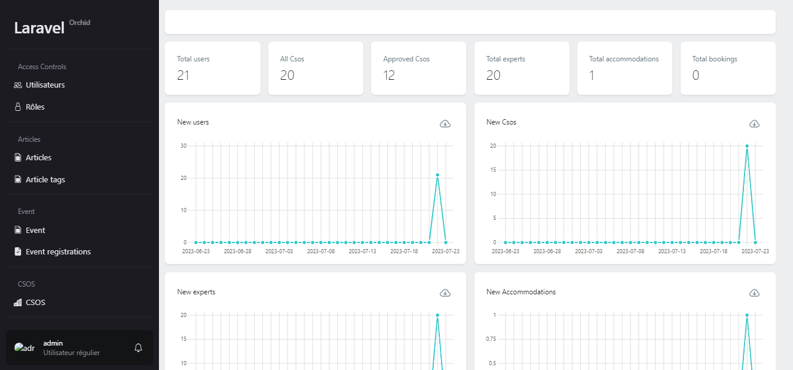
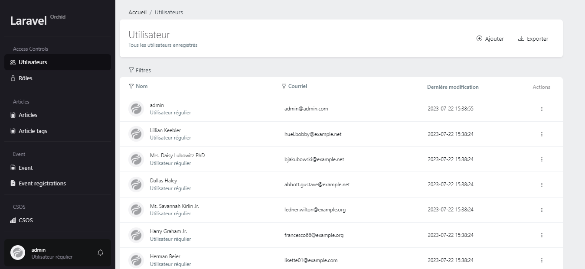
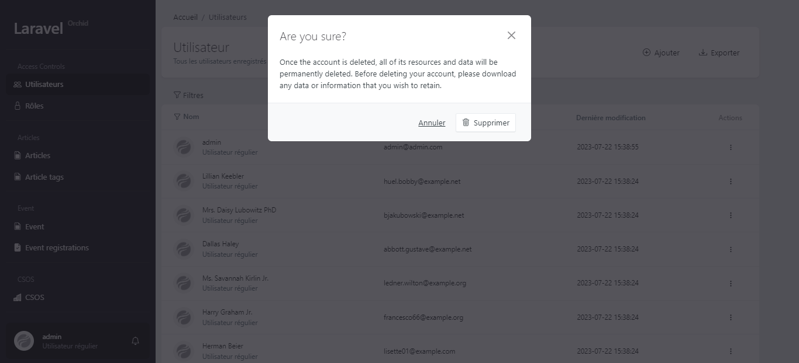
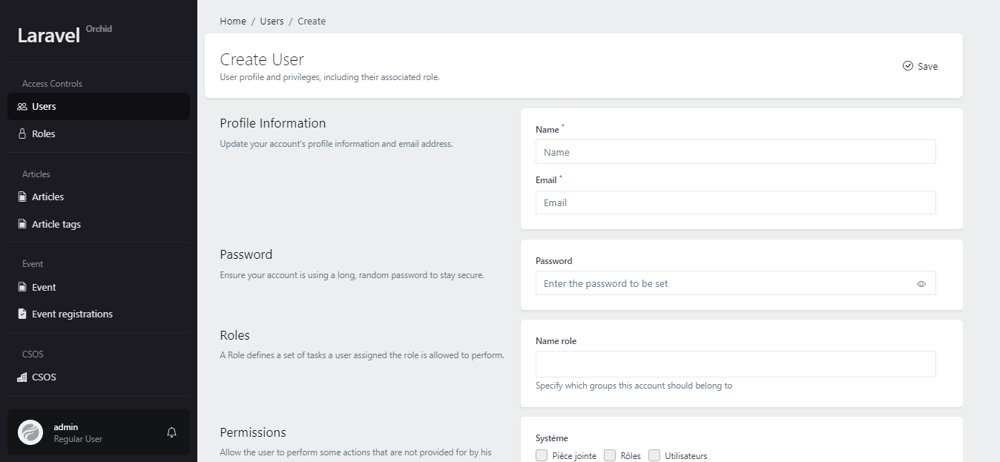
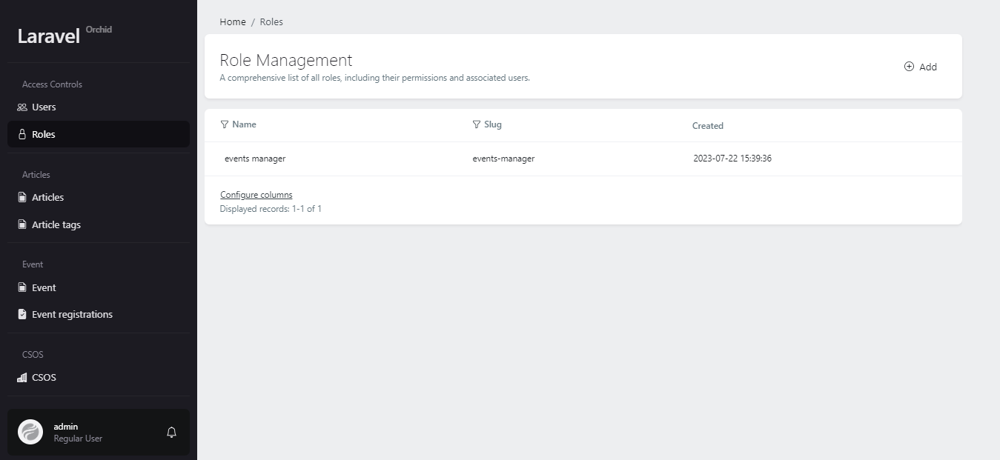
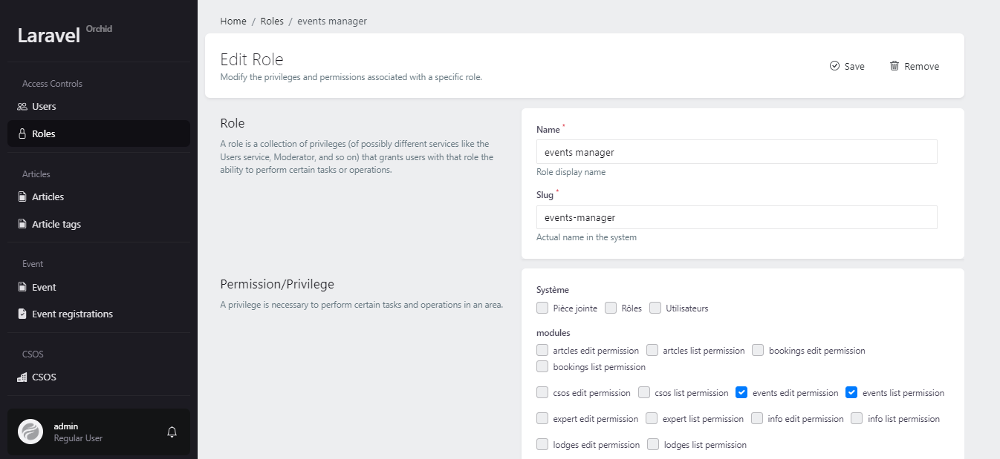
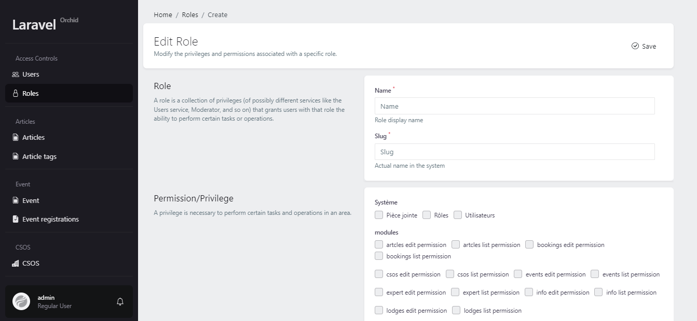
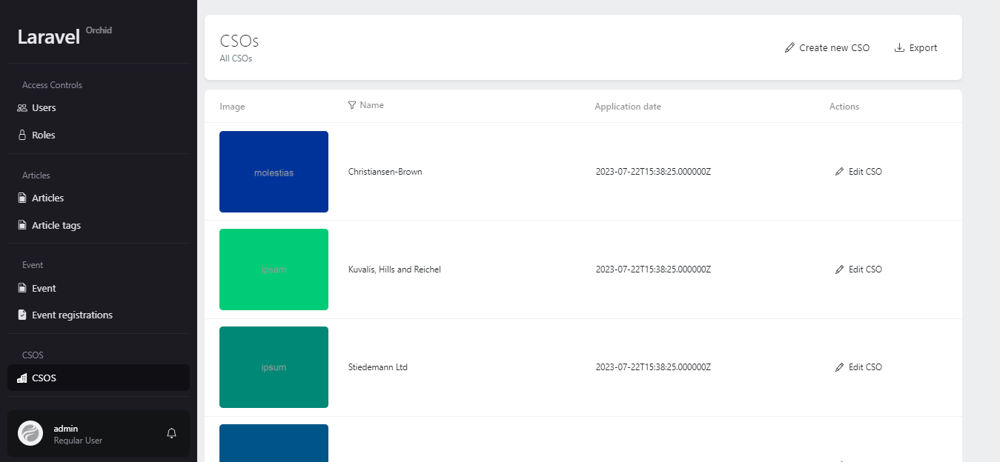
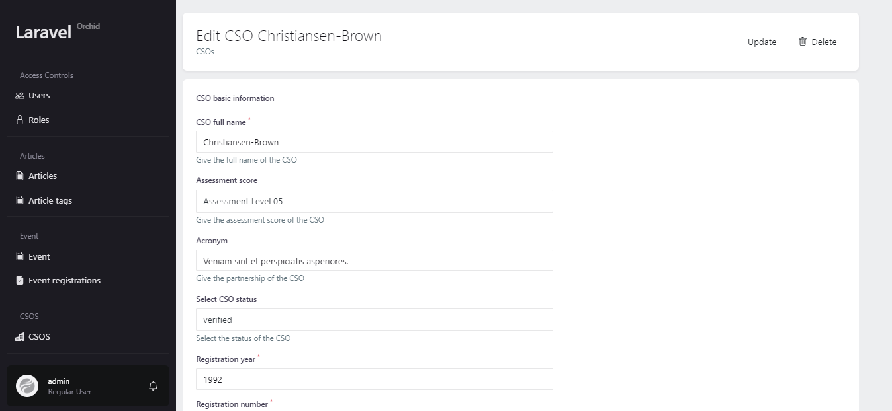
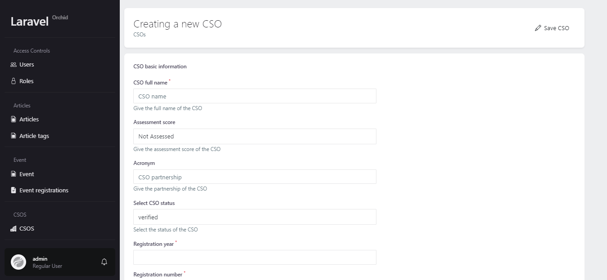

# USER MANUAL
This document describes the major features of the app and how to use them.

## SECTION A: Dashboard Users
Dashboard users are the administrators of the app who can manage users, roles, permissions, CSOs and other aspects of the app.

### Dashboard landing and statistics
The dashboard landing page shows an overview of the app's performance and statistics, such as the number of users, CSOs, and experts. You can access the dashboard landing page by logging in with your dashboard credentials, or by clicking on the title found at the top left corner of the dashboard page.

### Managing Users

You can view, edit, delete and create users from the Users page. To access the Users page, click on the Users link in the navigation bar.

On the Users page, you can see a table with all the users in the app. You can use the table filters to filter the users by name, or email. You can also use the pagination buttons to navigate through the pages of users.

To edit a user, click on menu button then the Edit button next to their name. This will open a page  where you can change their name, email, password, and role. To save your changes, click on the Update button.

To delete a user, click on the Delete button in the menu next to their name. This will open a confirmation dialog where you have to agree in order to proceed.

To create a new user, click on the Add button at the top right of the Users page. This will open a page where you have to enter their name, email, password and role. To create the user, click on the Save button.

### Roles and Permissions

You can manage the roles and permissions of the app from the Roles page. To access the Roles page, click on the Roles link in the navigation bar.

On the Roles page, you can see a table with all the roles in the app. You can use the filter to filter the roles by name. You can also use the pagination buttons to navigate through the pages of roles.

To edit a role, click on its name. This will open a page where you can change its name, slug and permissions. To save your changes, click on the Update button.

To delete a role, click on the Delete button found in the edit page.

To create a new role, click on the Create Role button at the top of the Roles page. This will open a page where you have to enter its name, slug and permissions. To create the role, click on the Save button.

### Managing CSOs
You can view, edit, delete and create CSOs from the CSOs page. To access the CSOs page, click on the CSOs link in the navigation bar.

On the CSOs page, you can see a table with all the CSOs in the app. You can use the search box to filter the CSOs by name, category or location. You can also use the pagination buttons to navigate through the pages of CSOs.

To edit a CSO, click on the Edit button in the menu button next to its name. This will open a page where you can change its name, category, location, description, logo and status. To save your changes, click on the Update button.

To delete a CSO, click on the Delete button next to its name. This will open a confirmation dialog where you have to click on Yes to confirm your action.

To create a new CSO, click on the Create CSO button at the top of the CSOs page. This will open a page where you have to enter all its information. To create the CSO, click on the Save button.

